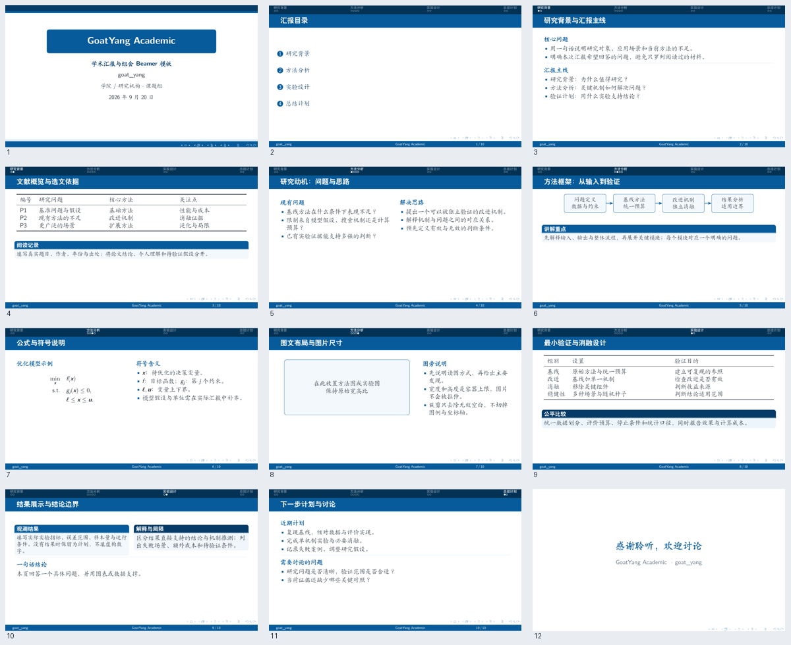

# GoatYang Academic

由 **goat_yang** 设计与维护的中文学术汇报 Beamer 模板。以学术蓝为主色，围绕论文精读、方法讲解和实验讨论设计，适用于组会、科研进展与课程汇报。



## 设计特点

- 16:9 宽屏，蓝色圆角标题框、上下装饰色带与可选双 Logo。
- 顶部章节导航与进度圆点，底部作者、短标题与页码三段信息栏。
- 紧凑标题栏、楷书正文与统一公式间距，延续成熟组会汇报的排版。
- 提供双栏分析、流程图、公式说明、图文页、三线表和结果讨论示例。
- 默认不插入章节过渡页；封面与致谢不计入正文页码。
- 默认使用 Fandol 字体，不依赖 Windows 字体与学校图片。

## 快速开始

安装包含中文支持的 TeX Live 或 MiKTeX，在模板目录执行：

```powershell
xelatex -interaction=nonstopmode -halt-on-error main.tex
xelatex -interaction=nonstopmode -halt-on-error main.tex
```

生成 `main.pdf`。两次编译用于稳定导航、目录与总页数。Overleaf 项目请选择 XeLaTeX 编译器。

修改 `main.tex` 顶部的标题、作者、机构、日期和 `\shortreporttitle` 即可开始。日期默认使用编译日期，可改为固定日期。正文中的内容均为写作示例，不代表真实论文或实验结论。

## 文件结构

| 文件 | 用途 |
| --- | --- |
| `main.tex` / `main.pdf` | 完整示例及编译结果 |
| `GoatYangAcademic.sty` | 主题、排版和通用组件 |
| `docs/preview.png` | 示例页面预览 |

## 常用配置

```tex
\usepackage{GoatYangAcademic}
\shortreporttitle{本次汇报简称}
\universitylogo{img/university-logo.pdf}
\schoollogo{img/school-logo.png}
% 按需开启：
\enableSectionPages
% 按需隐藏右下角导航符号：
\setbeamertemplate{navigation symbols}{}
```

Logo 默认留空，最多显示两张，自动保持宽高比。主题配色以 `GYBlue`、`GYDeepBlue`、`GYSkyBlue` 等命名，集中在主题文件开头。`\institute` 控制封面的机构文字。

## 内容组件

```tex
\topic{小标题}
\entry{带悬挂缩进的条目}
\contentdivider
\begin{compactcontent}
  \topic{适量紧凑内容}
  \entry{仅在当前环境内缩小字体与间距。}
\end{compactcontent}
\fitfigure{figures/result.pdf}{.95\linewidth}{4.5cm}
```

双栏推荐使用 `.48\textwidth` + `.48\textwidth` 和 `onlytextwidth`；图文页推荐 `.58` + `.38`。先拆页，再考虑紧凑排版，不建议整页强制缩放。图片宽、高均为上限，保留纵横比。

## 作者与发布

设计与维护：**goat_yang**。

- [GitHub 仓库](https://github.com/Yang-goat/goatyang-academic-beamer)
- [下载示例 PDF](https://github.com/Yang-goat/goatyang-academic-beamer/blob/main/main.pdf)
- [作者博客](https://goatyang.com/)

当前尚未指定发行许可证。学校标识保留在本地 `img/` 目录，默认示例不使用，Git 忽略规则默认排除。
